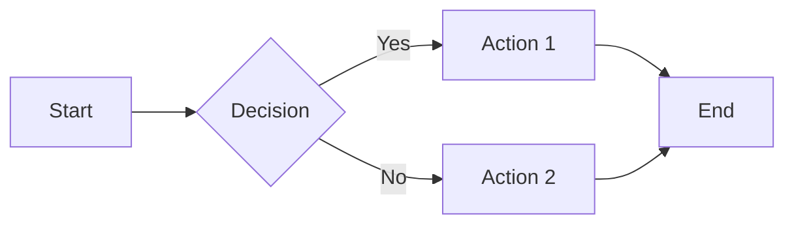
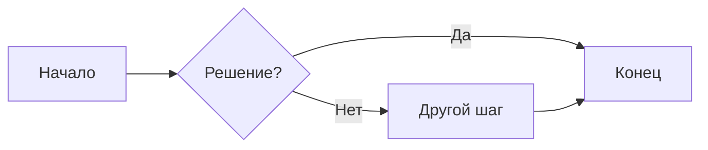
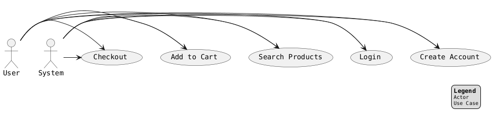

```mermaid
graph LR
    A[Start] --> B{Decision}
    B -- Yes --> C[Action 1]
    B -- No --> D[Action 2]
    C --> E[End]
    D --> E
```

```mermaid
graph LR
    A[Начало] --> B{Решение?}
    B -- Да --> C[Конец]
    B -- Нет --> D[Другой шаг]
    D --> C
```

```plantuml
@startuml
skinparam monochrome true
skinparam defaultFontName Monospaced

' Actors
actor User
actor System

' Use Cases
usecase "Create Account" as CreateAccount
usecase "Login" as Login
usecase "Search Products" as SearchProducts
usecase "Add to Cart" as AddToCart
usecase "Checkout" as Checkout

' Relationships
User -> CreateAccount
User -> Login
User -> SearchProducts
User -> AddToCart
User -> Checkout
System -> CreateAccount
System -> Login
System -> SearchProducts
System -> AddToCart
System -> Checkout

' Legend
legend right
  <font size="12"><b>Legend</b></font>
  <font size="10">Actor</font>
  <font size="10">Use Case</font>
endlegend

@enduml
```